# 数据库实验2设计报告1

<center>
    张翔雨 2018K8009929035 <br>吴俊亮 2018K8009929048 <br>王紫芮 2018K8009929024

## ER图

总体ER图如下图所示：


###  1. 用户预订车票book

实体users包括用户基本信息，实体stationlist记录车站号、车站名以及城市名，实体order记录订单相关信息。



### 2. 车站经过车次信息passstation

实体train记录车次信息与车辆种类。



### 3. 车次区间信息sectioninfo

sectioninfo记录车次的区间信息。has section表示车次与区间之间的联系，section pass station表示区间与车站之间的联系。



### 4. 车次区间是否有票has ticket



## 关系模式

根据ER图转换关系模式如下：

### 1. 用户users

对于用户的模式记录用户身份证号、姓名、手机号码、信用卡和用户名。

```sql
-- 记录用户数据
create table users
(
    u_user_id char(18) primary key,		-- 用户id（身份证号）
    u_user_name varchar(20) not null,	-- 姓名
    u_pnumber char(11) unique,			-- 手机号码
    u_credit_card char(16),				-- 信用卡
    u_account_id varchar(20) not null,	-- 用户名
    u_admin integer not null DEFAULT 0, -- 标志是否是管理员账户
    u_password varchar(20) not null     -- 账户密码
);
```

### 2. 订单order

记录订单信息

```sql
-- 记录订单信息
create table order
(
    o_order_id integer primary key,		-- 订单号
    o_user_id char(18) not null,		-- 用户id
    o_date date not null,				-- 订单日期
    o_train_id varchar(20) not null,	-- 车次
    o_sstation integer not null,        -- 出发站
    o_estation integer not null,        -- 到达站
    o_price decimal(5, 1) not null,		-- 购买金额
    o_seat_type integer not null,		-- 座椅种类
    o_status integer not null,			-- 订单状态

    foreign key (o_sstation) references stationlist(sl_station_id),
    foreign key (o_estation) references stationlist(sl_station_id),
    foreign key (o_user_id) references users(u_user_id),
    foreign key (o_train_id) references train(t_train_id)
);
```

### 3. 车站信息stationlist

记录车站信息

```sql
-- 记录每个车站的信息
create table stationlist
(
    sl_station_id integer primary key,		-- 车站号
    sl_station_name varchar(20) not null,	-- 车站名
    sl_city_name varchar(20) not null		-- 城市名
);
```

### 4. 车站经过车次信息passstation

记录每个车站的经过车次

```sql
-- 记录每个车站的经过车次
create table passstation
(
    ps_train_id varchar(20) not null,		-- 车次
    ps_station_id integer not null,			-- 车站号
    ps_in_time time,						-- 进站时间
    ps_out_time time,						-- 出站时间

    primary key (ps_station_id, ps_train_id),
    foreign key (ps_station_id) references stationlist(sl_station_id),
    foreign key (ps_train_id) references train(t_train_id)
);
```

### 5. 列车信息train

```sql
-- 记录列车信息
create table train
(
    t_train_id varchar(20) primary key,		-- 车次
    t_type char(1) not null					-- 车辆类型
);
```

### 6. 每趟列车每个区间的信息sectioninfo

记录每趟列车每个区间的信息

```sql
create table sectioninfo(
    si_train_id varchar(20) not null,		-- 车次
    si_section_id integer not null,			-- 区间号
    si_sstation integer not null,			-- 出发车站
    si_estation integer not null,			-- 到达车站
    si_stime time,							-- 出发时间
    si_etime time,							-- 到达时间
    si_sell_ticket integer,	        		-- 是否卖到到达站的票
    si_duration_time integer,				-- 行驶时间
    si_mileage integer,						-- 英里数
    si_tprice_YZ decimal(5,1),				-- 硬座价格
    si_tprice_RZ decimal(5,1),				-- 软座价格
    si_tprice_YWS decimal(5,1),				-- 硬卧（上）价格
    si_tprice_YWZ decimal(5,1),				-- 硬卧（中）价格
    si_tprice_YWX decimal(5,1),				-- 硬卧（下）价格
    si_tprice_RWS decimal(5,1),				-- 软卧（上）价格
    si_tprice_RWX decimal(5,1),				-- 软卧（下）价格

    primary key (si_train_id, si_section_id),
    foreign key (si_train_id) references train(t_train_id) on delete cascade,
    foreign key (si_sstation) references stationlist(sl_station_id),
    foreign key (si_estation) references stationlist(sl_station_id)
);
```

### 7. 余票信息sectionticket

记录每趟列车每个区间每天的余票

```sql
-- 记录每趟列车每个区间每天的余票
create table sectionticket
(
    st_train_id varchar(20) not null,		-- 车次
    st_section_id integer not null,			-- 区间号
    st_date date not null,					-- 日期
    st_tnum_YZ integer,						-- 硬座余票数量
    st_tnum_RZ integer,						-- 软座余票数量
    st_tnum_YWS integer,					-- 硬卧（上）余票数量
    st_tnum_YWZ integer,					-- 硬卧（中）余票数量
    st_tnum_YWX integer,					-- 硬卧（下）余票数量
    st_tnum_RWS integer,					-- 软卧（上）余票数量
    st_tnum_RWX integer,					-- 软卧（下）余票数量

    primary key (st_train_id, st_section_id, st_date),
    foreign key (st_train_id, st_section_id) references sectioninfo(si_train_id, si_section_id) 
    	on delete cascade
);
```

## 范式细化分析

对于一个实体中的每一个属性，选择一个与其他属性不重复的字母用于表示该属性。下文用加粗的红色字母表示该属性。

### 1. 用户users

​	users(
​    			u_user\_<font color=red>**i**</font>d,
​    			u_user\_<font color=red>**n**</font>ame,
​    			u\_<font color=red>**p**</font>number,
​    			u\_<font color=red>**c**</font>redit_card,
​    			u_<font color=red>a</font>ccount_id,
​    			u_ad<font color=red>**m**</font>in,
​    			u_pass<font color=red>**w**</font>ord
​			);

主键为i。身份证号和电话号码都可以唯一确定一个用户，所以函数依赖为i->inpcamw，p->inpcamw。因为用户的姓名、信用卡号和用户名都不是唯一的，所以不能唯一确定一个用户。

因为p是候选键，所以没有数据冗余问题，该关系模式满足BCNF。

### 2. 订单order
​	order(
​    			o\_<font color=red>**o**</font>rder_id,
​    			o\_<font color=red>**u**</font>ser_id,
​    			o\_<font color=red>**b**</font>ate,
​    			o\_<font color=red>**t**</font>rain_id,
   			 o_sstat<font color=red>**i**</font>on,
​    			o\_<font color=red>**e**</font>station,
​    			o\_<font color=red>**p**</font>rice,
​    			o_se<font color=red>**a**</font>t_type,
​    			o_<font color=red>**s**</font>tatus
​			);

主键为o，函数依赖为o->oudtiepas。一位用户不能在同一时间处于两辆列车上，但考虑到用户可以取消订单，所以o_status='paid'时udtie才能确定oudtiepa，不属于函数依赖，此处不予考虑。

此关系模式没有非平凡的函数依赖，满足BCNF。

### 3. 车站信息stationlist
​	stationlist(
​    			sl_station\_<font color=red>**i**</font>d,
​    			sl_station_<font color=red>**n**</font>ame,
​    			sl\_<font color=red>**c**</font>ity_name
​			);

主键为i。车站id和车站名都可以唯一确定一个车站，所以函数依赖为i->inc，n->inc。因为n是候选键，所以没有数据冗余问题，该关系模式满足BCNF。

### 4. 车站经过车次信息passstation
​	passstation(
​    			ps\_<font color=red>**t**</font>rain_id,
​    			ps\_<font color=red>**s**</font>tation_id,
​    			ps\_<font color=red>**i**</font>n_time,
​    			ps_<font color=red>**o**</font>ut_time,
​			);

主键为ts，函数依赖为ts->tsio。因为同一辆列车可能运行多天，在一天的相同时刻可能同时位于A站和B站，所以不存在ti->tsio或to->tsio。

此关系模式没有数据冗余问题，满足BCNF。

### 5. 列车信息train
​	train(
​    			t_train_<font color=red>**i**</font>d,
​    			t\_<font color=red>**t**</font>ype
​			);

主键为i，函数依赖为i -> it。

此关系模式没有数据冗余问题，满足BCNF。

### 6. 每趟列车每个区间的信息sectioninfo
sectioninfo(
    			si_tr<font color=red>**a**</font>in_id,
    			si_section\_<font color=red>**i**</font>d,
    			si\_<font color=red>**s**</font>station,
    			si\_<font color=red>**e**</font>station,
    			si_s<font color=red>**t**</font>ime,
    			si_eti<font color=red>**m**</font>e,
    			si_se<font color=red>**l**</font>l_ticket,
    			si_d<font color=red>**u**</font>ration_time,
    			si_milea<font color=red>**g**</font>e,
    			si_tprice\_<font color=red>**Y**</font>Z,
    			si_tpri<font color=red>**c**</font>e_RZ,
    			si_tprice_YW<font color=red>**S**</font>,
    			si_tprice_YW<font color=red>**Z**</font>,
   			 si_tprice_YW<font color=red>**X**</font>,
    			si_tprice_<font color=red>**R**</font>WS,
    			si_tprice_R<font color=red>**W**</font>X
			);

主键为ai，函数依赖为ai->aisetmlugYcSZXRW。因为一辆列车不会重复经过一个站，所以根据车站id也可以唯一确认一个表项，函数依赖为as->aisetmlugYcSZXRW，ae->aisetmlugYcSZXRW。

和passstation表相同，因为同一辆列车可能运行多天，在一天的相同时刻可能同时位于A站和B站，所以不存在at->aisetmlugYcSZXRW，am->aisetmlugYcSZXRW。

因为两站之间可能存在不同的路线，所以不存在se->g。因为as，ae都是超键，所以没有数据冗余问题，该关系模式满足BCNF。

### 7. 余票信息sectionticket
sectionticket(
    			st\_<font color=red>**t**</font>rain_id,
    			si_s<font color=red>**e**</font>ction_id,
    			st\_<font color=red>**d**</font>ate,
    			st_tnum\_<font color=red>**Y**</font>Z,
    			st_tnum_<font color=red>**R**</font>Z,
    			st_tnum_YW<font color=red>**S**</font>,
    			st_tnum_YW<font color=red>**Z**</font>,
    			st_tnum_YW<font color=red>**X**</font>,
    			st_t<font color=red>**n**</font>um_RWS,
    			st_tn<font color=red>**u**</font>m_RWX
			);

主键为ted，函数依赖为ted->tdYRSZXnu。此关系模式没有数据冗余问题，满足BCNF。