# 数据库实验2设计报告2

<center>
    张翔雨 2018K8009929035 <br>吴俊亮 2018K8009929048 <br>王紫芮 2018K8009929024
</center>

## ER图

总体ER图如下图所示：


###  1. 用户预订车票book

实体users包括用户基本信息，实体stationlist记录车站号、车站名以及城市名，实体order记录订单相关信息。


### 2. 车站经过车次信息passstation

实体train记录车次信息与车辆种类。


### 3. 车次区间信息sectioninfo

sectioninfo记录车次的区间信息。has section表示车次与区间之间的联系，section pass station表示区间与车站之间的联系。



### 4. 车次区间是否有票has ticket



## 关系模式

根据ER图转换关系模式如下：

### 1. 用户users

记录用户身份证号、姓名、手机号码、信用卡和用户名。

```sql
-- 记录用户数据
create table users
(
    u_user_id char(18) primary key,		-- 用户id（身份证号）
    u_user_name varchar(20) not null,	-- 姓名
    u_pnumber char(11) unique,			-- 手机号码
    u_credit_card char(16),				-- 信用卡
    u_account_id varchar(20) not null,	-- 用户名
    u_admin integer not null DEFAULT 0, -- 标志是否是管理员账户
    u_password varchar(20) not null     -- 账户密码
);
```

### 2. 订单order

记录订单信息

```sql
-- 记录订单信息
create table order
(
    o_order_id integer primary key,		-- 订单号
    o_user_id char(18) not null,		-- 用户id
    o_date date not null,				-- 订单日期
    o_train_id varchar(20) not null,	-- 车次
    o_sstation integer not null,        -- 出发站
    o_estation integer not null,        -- 到达站
    o_price decimal(5, 1) not null,		-- 购买金额
    o_seat_type integer not null,		-- 座椅种类
    o_status integer not null,			-- 订单状态
    o_another_id integer not null default 0, -- 如果为联票订单，则存另一个车次的订单ID

    foreign key (o_sstation) references stationlist(sl_station_id),
    foreign key (o_estation) references stationlist(sl_station_id),
    foreign key (o_user_id) references users(u_user_id),
    foreign key (o_train_id) references train(t_train_id)
);
```

### 3. 车站信息stationlist

记录车站信息

```sql
-- 记录每个车站的信息
create table stationlist
(
    sl_station_id integer primary key,		-- 车站号
    sl_station_name varchar(20) not null,	-- 车站名
    sl_city_name varchar(20) not null		-- 城市名
);
```

### 4. 车站经过车次信息passstation

记录每个车站的经过车次

```sql
-- 记录每个车站的经过车次
create table passstation
(
    ps_train_id varchar(20) not null,		-- 车次
    ps_station_id integer not null,			-- 车站号
    ps_in_time time,						-- 进站时间
    ps_out_time time,						-- 出站时间

    primary key (ps_station_id, ps_train_id),
    foreign key (ps_station_id) references stationlist(sl_station_id),
    foreign key (ps_train_id) references train(t_train_id)
);
```

### 5. 列车信息train

```sql
-- 记录列车信息
create table train
(
    t_train_id varchar(20) primary key,		-- 车次
    t_type char(1) not null					-- 车辆类型
);
```

### 6. 每趟列车每个区间的信息sectioninfo

记录每趟列车每个区间的信息

```sql
create table sectioninfo(
    si_train_id varchar(20) not null,		-- 车次
    si_section_id integer not null,			-- 区间号
    si_sstation integer not null,			-- 出发车站
    si_estation integer not null,			-- 到达车站
    si_sstaytime integer not null,          -- 在出发车站停留的时间
    si_stime time,							-- 出发时间
    si_etime time,							-- 到达时间
    si_sell_ticket integer,	        		-- 是否卖到到达站的票
    si_duration_time integer,				-- 行驶时间
    si_mileage integer,						-- 英里数
    si_tprice_YZ decimal(5,1),				-- 硬座价格
    si_tprice_RZ decimal(5,1),				-- 软座价格
    si_tprice_YWS decimal(5,1),				-- 硬卧（上）价格
    si_tprice_YWZ decimal(5,1),				-- 硬卧（中）价格
    si_tprice_YWX decimal(5,1),				-- 硬卧（下）价格
    si_tprice_RWS decimal(5,1),				-- 软卧（上）价格
    si_tprice_RWX decimal(5,1),				-- 软卧（下）价格

    primary key (si_train_id, si_section_id),
    foreign key (si_train_id) references train(t_train_id) on delete cascade,
    foreign key (si_sstation) references stationlist(sl_station_id),
    foreign key (si_estation) references stationlist(sl_station_id)
);
```

### 7. 余票信息sectionticket

记录每趟列车每个区间每天的余票

```sql
-- 记录每趟列车每个区间每天的余票
create table sectionticket
(
    st_train_id varchar(20) not null,		-- 车次
    st_section_id integer not null,			-- 区间号
    st_train_date date not null,			-- 起始日期
    st_sdate date ,                         -- 出发车站的出发日期
    st_edate date,							-- 到达车站的到达日期
    st_tnum_YZ integer,						-- 硬座余票数量
    st_tnum_RZ integer,						-- 软座余票数量
    st_tnum_YWS integer,					-- 硬卧（上）余票数量
    st_tnum_YWZ integer,					-- 硬卧（中）余票数量
    st_tnum_YWX integer,					-- 硬卧（下）余票数量
    st_tnum_RWS integer,					-- 软卧（上）余票数量
    st_tnum_RWX integer,					-- 软卧（下）余票数量

    primary key (st_train_id, st_section_id, st_train_date),
    foreign key (st_train_id, st_section_id) references sectioninfo(si_train_id, si_section_id) 
    	on delete cascade
);
```

## 范式细化分析

对于一个实体中的每一个属性，选择一个与其他属性不重复的字母用于表示该属性。下文用加粗的红色字母表示该属性。

### 1. 用户users

​	users(
​    			u_user\_<font color=red>**i**</font>d,
​    			u_user\_<font color=red>**n**</font>ame,
​    			u\_<font color=red>**p**</font>number,
​    			u\_<font color=red>**c**</font>redit_card,
​    			u_<font color=red>a</font>ccount_id,
​    			u_ad<font color=red>**m**</font>in,
​    			u_pass<font color=red>**w**</font>ord
​			);

主键为i。身份证号和电话号码都可以唯一确定一个用户，所以函数依赖为i->inpcamw，p->inpcamw。因为用户的姓名、信用卡号和用户名都不是唯一的，所以不能唯一确定一个用户。

因为p是候选键，所以没有数据冗余问题，该关系模式满足BCNF。

### 2. 订单order
​	order(
​    			o\_<font color=red>**o**</font>rder_id,
​    			o\_<font color=red>**u**</font>ser_id,
​    			o\_<font color=red>**d**</font>ate,
​    			o\_<font color=red>**t**</font>rain_id,
   			 o\_sstat<font color=red>**i**</font>on,
​    			o\_<font color=red>**e**</font>station,
​    			o\_<font color=red>**p**</font>rice,
​    			o_se<font color=red>**a**</font>t_type,
​    			o_<font color=red>**s**</font>tatus,
​    			o\_a<font color=red>**n**</font>other_id
​			);

主键为o，函数依赖为o->oudtiepasn。一位用户不能在同一时间处于两辆列车上，但考虑到用户可以取消订单，所以o_status='paid'时udtie才能确定onudtiepa，不属于函数依赖，此处不予考虑。

此关系模式没有非平凡的函数依赖，满足BCNF。

### 3. 车站信息stationlist
​	stationlist(
​    			sl_station\_<font color=red>**i**</font>d,
​    			sl_station_<font color=red>**n**</font>ame,
​    			sl\_<font color=red>**c**</font>ity_name
​			);

主键为i。车站id和车站名都可以唯一确定一个车站，所以函数依赖为i->inc，n->inc。因为n是候选键，所以没有数据冗余问题，该关系模式满足BCNF。

### 4. 车站经过车次信息passstation
​	passstation(
​    			ps\_<font color=red>**t**</font>rain_id,
​    			ps\_<font color=red>**s**</font>tation_id,
​    			ps\_<font color=red>**i**</font>n_time,
​    			ps_<font color=red>**o**</font>ut_time,
​			);

主键为ts，函数依赖为ts->tsio。因为同一辆列车可能运行多天，在一天的相同时刻可能同时位于A站和B站，所以不存在ti->tsio或to->tsio。

此关系模式没有数据冗余问题，满足BCNF。

### 5. 列车信息train
​	train(
​    			t_train_<font color=red>**i**</font>d,
​    			t\_<font color=red>**t**</font>ype
​			);

主键为i，函数依赖为i->it。

此关系模式没有数据冗余问题，满足BCNF。

### 6. 每趟列车每个区间的信息sectioninfo
sectioninfo(
    			si_tr<font color=red>**a**</font>in_id,
    			si_section\_<font color=red>**i**</font>d,
    			si\_<font color=red>**s**</font>station,
    			si\_<font color=red>**e**</font>station,
    			si\_ssta<font color=red>**y**</font>time,
    			si_s<font color=red>**t**</font>ime,
    			si_eti<font color=red>**m**</font>e,
    			si_se<font color=red>**l**</font>l_ticket,
    			si_d<font color=red>**u**</font>ration_time,
    			si_milea<font color=red>**g**</font>e,
    			si_tprice\_<font color=red>**Y**</font>Z,
    			si_tpri<font color=red>**c**</font>e_RZ,
    			si_tprice_YW<font color=red>**S**</font>,
    			si_tprice_YW<font color=red>**Z**</font>,
   			 si_tprice_YW<font color=red>**X**</font>,
    			si_tprice_<font color=red>**R**</font>WS,
    			si_tprice_R<font color=red>**W**</font>X
			);

主键为ai，函数依赖为ai->aiseytmlugYcSZXRW。因为一辆列车不会重复经过一个站，所以根据车站id也可以唯一确认一个表项，函数依赖为as->aiseytmlugYcSZXRW，ae->aiseytmlugYcSZXRW。

和passstation表相同，因为同一辆列车可能运行多天，在一天的相同时刻可能同时位于A站和B站，所以不存在at->aiseytmlugYcSZXRW，am->aiseytmlugYcSZXRW。

因为两站之间可能存在不同的路线，所以不存在se->g。因为as，ae都是超键，所以没有数据冗余问题，该关系模式满足BCNF。

### 7. 余票信息sectionticket
sectionticket(
    			st\_<font color=red>**t**</font>rain_id,
    			si_s<font color=red>**e**</font>ction_id,
    			st\_train\_<font color=red>**d**</font>ate,
    			st\_<font color=red>**s**</font>date,
    			st\_ed<font color=red>**a**</font>te,
    			st_tnum\_<font color=red>**Y**</font>Z,
    			st_tnum_<font color=red>**R**</font>Z,
    			st_tnum_YW<font color=red>**S**</font>,
    			st_tnum_YW<font color=red>**Z**</font>,
    			st_tnum_YW<font color=red>**X**</font>,
    			st_t<font color=red>**n**</font>um_RWS,
    			st_tn<font color=red>**u**</font>m_RWX
			);

主键为ted，函数依赖为ted->satdYRSZXnu。此关系模式没有数据冗余问题，满足BCNF。

## sql查询语句模板

### 1. 需求3：记录乘客信息

#### （1）注册用户

插入用户信息，若产生键值冲突，则会报错，并重新进入注册页面。

```sql
insert into users 
values ('$u_user_id','$u_user_name','$u_pnumber','$u_credit_card','$u_account_id',0,'$u_password');
```

#### （2）用户登录验证

获得当前用户信息进行比对。

```sql
select u_account_id , u_password ,u_admin, u_user_id
from users
where u_account_id='$accountid' and u_password='$pwd';
```

### 2. 需求4：查询具体车次

可以从passstation表和stationlist表中查到列车经过的车站，包括车站号、车站名、到达时间和出发时间。可以从sectioninfo表和sectionticket表中查询到列车经过区间的详细信息，输出区间号用于排序、区间到达站用于连接，若该区间卖到到达站的票，还需要输出从起点站到此站的票价和余票。此处需要注意sectioninfo表中存储的是区间票价和区间余票，我们需要求和来计算总票价，求最小值来计算全程余票。

将上述两个子查询得到的表格进行左连接并排序即得到车次信息。

```sql
select 
    station.sl_station_name, 
    station.ps_in_time, 
    station.ps_out_time,
    info.price_YZ,
    info.price_RZ,
    info.price_YWS,
    info.price_YWZ,
    info.price_YWX,
    info.price_RWS,
    info.price_RWX,
    info.YZ,
    info.RZ,
    info.YWS,
    info.YWZ,
    info.YWX,
    info.RWS,
    info.RWX
from
    (
        select 
            ps_station_id,
            sl_station_name,
            ps_in_time, 
            ps_out_time
        from
            stationlist,
            passstation
        where
            ps_train_id = '$trainid'
            and ps_station_id = sl_station_id
    ) as station    -- 列车经过的车站，包括车站号、车站名、到达时间和出发时间
    left outer join
    (
        select
            cur.si_section_id as section_id,
            cur.si_estation as estation,
            (case when cur.si_sell_ticket = 0 then sum(total.si_price_YZ) else 0 end) as price_YZ,
            (case when cur.si_sell_ticket = 0 then sum(total.si_price_RZ) else 0 end) as price_RZ,
            (case when cur.si_sell_ticket = 0 then sum(total.si_price_YWS) else 0 end) as price_YWS,
            (case when cur.si_sell_ticket = 0 then sum(total.si_price_YWZ) else 0 end) as price_YWZ,
            (case when cur.si_sell_ticket = 0 then sum(total.si_price_YWX) else 0 end) as price_YWX,
            (case when cur.si_sell_ticket = 0 then sum(total.si_price_RWS) else 0 end) as price_RWS,
            (case when cur.si_sell_ticket = 0 then sum(total.si_price_RWX) else 0 end) as price_RWX,
            (case when cur.si_sell_ticket = 0 then min(st_tnum_YZ) else 0 end) as YZ,
            (case when cur.si_sell_ticket = 0 then min(st_tnum_RZ) else 0 end) as RZ,
            (case when cur.si_sell_ticket = 0 then min(st_tnum_YWS) else 0 end) as YWS,
            (case when cur.si_sell_ticket = 0 then min(st_tnum_YWZ) else 0 end) as YWZ,
            (case when cur.si_sell_ticket = 0 then min(st_tnum_YWX) else 0 end) as YWX,
            (case when cur.si_sell_ticket = 0 then min(st_tnum_RWS) else 0 end) as RWS,
            (case when cur.si_sell_ticket = 0 then min(st_tnum_RWX) else 0 end) as RWX
        from
            sectioninfo as cur,
            sectioninfo as total,
            sectionticket
        where
            cur.si_train_id = '$trainid'
            and total.si_train_id = cur.si_train_id         -- 匹配列车号
            and total.si_section_id <= cur.si_section_id    -- 表示该站前的所有区间
            and st_train_id = cur.si_train_id
            and st_section_id = total.si_section_id
            and st_sdate = '$date'                          -- 匹配日期
        group by
            cur.si_section_id,
            cur.si_estation,
            cur.si_sell_ticket
    ) as info
on
    station.ps_station_id = info.estation
order by
    (case when info.section_id is null then 0 else info.section_id end);
```

### 3. 需求5：查询两地之间的车次

#### （1）查询直达车次

首先从stationlist表中根据出发城市名和到达城市名查询得到出发地的车站号（`start_station`）和到达站的车站号（`end_station`）。然后从sectioninfo表、sectionticket表中查询合适的车次和相关信息。从stationlist表中查询得到车站名用于向用户展示。

考虑到车次隔夜运行的情况，sectionticket表中的`st_train_date`表示该列车从起点站的出发日期（唯一标识一个车次），`st_sdate`表示该列车从区间起始站的出发日期，`st_edate`表示该列车到达区间终点站的到达日期。查询余票时，用户输入的日期要和第一个区间的`st_sdate`匹配，随后所有区间的`st_train_date`都要和第一个区间的匹配。

```sql
select
    first_section.si_train_id as train,
    start_sl.sl_station_name as sstation,
    end_sl.sl_station_name as estation,
    last_section.si_etime as etime,
    min(all_st.st_tnum_YZ) as YZ,
    min(all_st.st_tnum_RZ) as RZ,
    min(all_st.st_tnum_YWS) as YWS,
    min(all_st.st_tnum_YWZ) as YWZ,
    min(all_st.st_tnum_YWX) as YWX,
    min(all_st.st_tnum_RWS) as RWS,
    min(all_st.st_tnum_RWX) as RWX,
    sum(all_section.si_price_YZ) as price_YZ,
    sum(all_section.si_price_RZ) as price_RZ,
    sum(all_section.si_price_YWS) as price_YWS,
    sum(all_section.si_price_YWZ) as price_YWZ,
    sum(all_section.si_price_YWX) as price_YWX,
    sum(all_section.si_price_RWS) as price_RWS,
    sum(all_section.si_price_RWX)  as price_RWX,  
    (case 
    when min(all_st.st_tnum_YZ) <> 0 then  sum(all_section.si_price_YZ)
    when min(all_st.st_tnum_RZ) <> 0 then  sum(all_section.si_price_RZ)
    when min(all_st.st_tnum_YWS) <> 0 then  sum(all_section.si_price_YWS)
    when min(all_st.st_tnum_YWZ) <> 0 then  sum(all_section.si_price_YWZ)
    when min(all_st.st_tnum_YWX) <> 0 then  sum(all_section.si_price_YWX)
    when min(all_st.st_tnum_RWS) <> 0 then  sum(all_section.si_price_RWS)
    when min(all_st.st_tnum_RWX) <> 0 then  sum(all_section.si_price_RWX)
    else 0
    end) as price,
    (sum(all_section.si_duration_time) - first_section.si_sstaytime) as duration_time,
    first_section.si_stime as start_time
from
    (
        select
            sl_station_id
        from 
            stationlist
        where
            sl_city_name ='$start_city'
    ) as start_station, -- 起点站
    (
        select
            sl_station_id
        from 
            stationlist
        where
            sl_city_name = '$end_city'
    ) as end_station,   -- 终点站
    sectioninfo as first_section,   -- 第一个区间
    sectioninfo as last_section,    -- 最后一个区间
    sectioninfo as all_section,     -- 全部区间
    sectionticket as first_st,      -- 第一个区间余票
    sectionticket as all_st,        -- 全部区间余票
    stationlist as start_sl,        -- 起点站名
    stationlist as end_sl           -- 终点站名
where
    first_section.si_train_id = last_section.si_train_id
    and first_section.si_sstation = start_station.sl_station_id
    and last_section.si_estation = end_station.sl_station_id
    and last_section.si_sell_ticket = 0
    and first_section.si_section_id <= last_section.si_section_id   -- 匹配起点终点站
    and first_section.si_stime > '$go_time'                           -- 检查出发时间
    and all_section.si_train_id = first_section.si_train_id
    and all_section.si_section_id >= first_section.si_section_id
    and all_section.si_section_id <= last_section.si_section_id     -- 所有区间信息
    and first_st.st_train_id = first_section.si_train_id
    and first_st.st_section_id = first_section.si_section_id
    and first_st.st_sdate = '$go_date'                                -- 第一个区间余票用于匹配日期
    and all_st.st_train_id = first_section.si_train_id
    and all_st.st_section_id = all_section.si_section_id        
    and all_st.st_train_date = first_st.st_train_date               -- 所有区间余票
    and start_sl.sl_station_id = first_section.si_sstation
    and end_sl.sl_station_id = last_section.si_estation             -- 起终点站名
group by
    first_section.si_train_id,
    first_section.si_sstaytime,
    first_section.si_stime,
    last_section.si_etime,
    start_sl.sl_station_name,
    end_sl.sl_station_name
having
    min(all_st.st_tnum_YZ) + min(all_st.st_tnum_RZ) + min(all_st.st_tnum_YWS) + min(all_st.st_tnum_YWZ) + 
    min(all_st.st_tnum_YWX) + min(all_st.st_tnum_RWS) + min(all_st.st_tnum_RWX) <> 0    -- 有票
order by
    price,
    duration_time,
    start_time
limit
    10;

```

#### （2）查询换乘

查询换乘时根据起点站查询到所有符合条件的第一辆车，根据终点站查询到所有符合条件的第二辆车。再检查换乘站，如果换乘地是同一车站，那么1小时<=换乘经停时间<=4小时；如果换乘地是同城的不同车站，那么2小时<=换乘经停时间<=4小时。

此处有几点需要注意。第一，若第一辆车运行超过了0点，那么第二辆车的上车时间应该是第二天；也就是说第二辆车查询余票信息时需要第一辆车的到达日期信息，查询第一辆车信息的select语句必须是查询第二辆车信息的select语句的子查询。第二，在换乘站中过夜时，得到的换乘经停时间为负数，此时加上24小时即可。

```sql
select
    train1_etime,                                   -- 第一辆车到达时间
    train1_train as train1_id,                      -- 第一辆车车次
    start1_sl.sl_station_name as sstation,          -- 第一辆车起点站
    end1_sl.sl_station_name as trans_station1,      -- 第一辆车终点站
    (case when (stime - train1_etime) < interval'0min' then (stime - train1_etime + interval'24hour')
    else (stime - train1_etime) end) as wait_time,  -- 换乘经停时间
    sdate as train2_sdate,                          -- 第二辆车出发日期
    train as train2_id,                             -- 第二辆车车次
    start2_sl.sl_station_name as trans_station2,    -- 第二辆车起点站
    end2_sl.sl_station_name as estation,            -- 第二辆车终点站
    train1_YZ,
    train1_RZ,
    train1_YWS,
    train1_YWZ,
    train1_YWX,
    train1_RWS,
    train1_RWX,
    train1_price_YZ,
    train1_price_RZ,
    train1_price_YWS,
    train1_price_YWZ,
    train1_price_YWX,
    train1_price_RWS,
    train1_price_RWX,
    YZ,
    RZ,
    YWX,
    YWZ,
    YWX,
    RWS,
    RWX,
    price_YZ,
    price_RZ,
    price_YWS,
    price_YWZ,
    price_YWX,
    price_RWS,
    price_RWX,
    (train1_price + price) as price,
    train1_duration_time +
    duration_time +
    (case
    when (extract(hour from stime) * 60 - extract(hour from train1_etime) * 60 +
    extract(minute from stime) - extract(minute from train1_etime)) < 0
    then (extract(hour from stime) * 60 - extract(hour from train1_etime) * 60 +
    extract(minute from stime) - extract(minute from train1_etime) + 24 * 60)
    else (extract(hour from stime) * 60 - extract(hour from train1_etime) * 60 +
    extract(minute from stime) - extract(minute from train1_etime))
    end)
    as duration_time,
    train1_stime as start_time
from
    (
        select  -- 该子查询返回第二辆车的所有信息的同时传递第一辆车的所有信息并检查换乘条件
            first_section.si_train_id as train,
            first_st.st_sdate as sdate,
            first_section.si_stime as stime,
            first_section.si_sstation as station,
            last_section.si_estation as end_station,
            min(all_st.st_tnum_YZ) as YZ,
            min(all_st.st_tnum_RZ) as RZ,
            min(all_st.st_tnum_YWS) as YWS,
            min(all_st.st_tnum_YWZ) as YWZ,
            min(all_st.st_tnum_YWX) as YWX,
            min(all_st.st_tnum_RWS) as RWS,
            min(all_st.st_tnum_RWX) as RWX,
            sum(all_section.si_price_YZ) as price_YZ,
            sum(all_section.si_price_RZ) as price_RZ,
            sum(all_section.si_price_YWS) as price_YWS,
            sum(all_section.si_price_YWZ) as price_YWZ,
            sum(all_section.si_price_YWX) as price_YWX,
            sum(all_section.si_price_RWS) as price_RWS,
            sum(all_section.si_price_RWX)  as price_RWX,  
            (case 
            when min(all_st.st_tnum_YZ) <> 0 then  sum(all_section.si_price_YZ)
            when min(all_st.st_tnum_RZ) <> 0 then  sum(all_section.si_price_RZ)
            when min(all_st.st_tnum_YWS) <> 0 then  sum(all_section.si_price_YWS)
            when min(all_st.st_tnum_YWZ) <> 0 then  sum(all_section.si_price_YWZ)
            when min(all_st.st_tnum_YWX) <> 0 then  sum(all_section.si_price_YWX)
            when min(all_st.st_tnum_RWS) <> 0 then  sum(all_section.si_price_RWS)
            when min(all_st.st_tnum_RWX) <> 0 then  sum(all_section.si_price_RWX)
            else 0
            end) as price,
            (sum(all_section.si_duration_time) - first_section.si_sstaytime) as duration_time,

            train1.train as train1_train,
            train1.stime as train1_stime,
            train1.etime as train1_etime,
            train1.start_station as train1_start_station,
            train1.station as train1_station,
            train1.edate as train1_edate,          
            train1.YZ as train1_YZ,
            train1.RZ as train1_RZ,
            train1.YWS as train1_YWS,
            train1.YWZ as train1_YWZ,
            train1.YWX as train1_YWX,
            train1.RWS as train1_RWS,
            train1.RWX as train1_RWX,
            train1.price_YZ as train1_price_YZ,
            train1.price_RZ as train1_price_RZ,
            train1.price_YWS as train1_price_YWS,
            train1.price_YWZ as train1_price_YWZ,
            train1.price_YWX as train1_price_YWX,
            train1.price_RWS as train1_price_RWS,
            train1.price_RWX as train1_price_RWX,
            train1.price as train1_price,
            train1.duration_time as train1_duration_time
        from
            (
                select -- 该子查询返回第一辆车的所有信息
                    first_section.si_train_id as train,
                    first_section.si_stime as stime,
                    last_section.si_etime as etime,
                    first_section.si_sstation as start_station,
                    last_section.si_estation as station,            
                    last_st.st_edate as edate,          
                    min(all_st.st_tnum_YZ) as YZ,
                    min(all_st.st_tnum_RZ) as RZ,
                    min(all_st.st_tnum_YWS) as YWS,
                    min(all_st.st_tnum_YWZ) as YWZ,
                    min(all_st.st_tnum_YWX) as YWX,
                    min(all_st.st_tnum_RWS) as RWS,
                    min(all_st.st_tnum_RWX) as RWX,
                    sum(all_section.si_price_YZ) as price_YZ,
                    sum(all_section.si_price_RZ) as price_RZ,
                    sum(all_section.si_price_YWS) as price_YWS,
                    sum(all_section.si_price_YWZ) as price_YWZ,
                    sum(all_section.si_price_YWX) as price_YWX,
                    sum(all_section.si_price_RWS) as price_RWS,
                    sum(all_section.si_price_RWX)  as price_RWX,  
                    (case 
                    when min(all_st.st_tnum_YZ) <> 0 then  sum(all_section.si_price_YZ)
                    when min(all_st.st_tnum_RZ) <> 0 then  sum(all_section.si_price_RZ)
                    when min(all_st.st_tnum_YWS) <> 0 then  sum(all_section.si_price_YWS)
                    when min(all_st.st_tnum_YWZ) <> 0 then  sum(all_section.si_price_YWZ)
                    when min(all_st.st_tnum_YWX) <> 0 then  sum(all_section.si_price_YWX)
                    when min(all_st.st_tnum_RWS) <> 0 then  sum(all_section.si_price_RWS)
                    when min(all_st.st_tnum_RWX) <> 0 then  sum(all_section.si_price_RWX)
                    else 0
                    end) as price,
                    (sum(all_section.si_duration_time) - first_section.si_sstaytime) as duration_time
                from
                    (
                        select
                            sl_station_id
                        from 
                            stationlist
                        where
                            sl_city_name = '$start_city'
                    ) as start_station, 
                    sectioninfo as first_section,
                    sectioninfo as last_section,
                    sectioninfo as all_section,
                    sectionticket as first_st,
                    sectionticket as last_st,
                    sectionticket as all_st
                where
                    first_section.si_train_id = last_section.si_train_id
                    and first_section.si_sstation = start_station.sl_station_id
                    and last_section.si_sell_ticket = 0
                    and first_section.si_section_id <= last_section.si_section_id 
                    and first_section.si_stime > '$go_time'                          
                    and all_section.si_train_id = first_section.si_train_id
                    and all_section.si_section_id >= first_section.si_section_id
                    and all_section.si_section_id <= last_section.si_section_id   
                    and first_st.st_train_id = first_section.si_train_id
                    and first_st.st_section_id = first_section.si_section_id
                    and first_st.st_sdate = '$go_date'                         
                    and last_st.st_train_id = first_section.si_train_id
                    and last_st.st_section_id = last_section.si_section_id        
                    and last_st.st_train_date = first_st.st_train_date            
                    and all_st.st_train_id = first_section.si_train_id
                    and all_st.st_section_id = all_section.si_section_id            
                    and all_st.st_train_date = first_st.st_train_date             
                group by
                    first_section.si_train_id,
                    first_section.si_stime,
                    last_section.si_etime,
                    last_section.si_estation,            
                    last_st.st_edate,
                    first_section.si_sstaytime,
                    first_section.si_sstation,
                    last_section.si_estation
            ) as train1,
            (
                select
                    sl_station_id
                from 
                    stationlist
                where
                    sl_city_name = '$end_city'
            ) as end_station,  
            sectioninfo as first_section,
            sectioninfo as last_section,
            sectioninfo as all_section,
            sectionticket as first_st,
            sectionticket as all_st
        where
            first_section.si_train_id = last_section.si_train_id
            and last_section.si_estation = end_station.sl_station_id
            and last_section.si_sell_ticket = 0
            and first_section.si_section_id <= last_section.si_section_id 
            and all_section.si_train_id = first_section.si_train_id
            and all_section.si_section_id >= first_section.si_section_id
            and all_section.si_section_id <= last_section.si_section_id   
            and first_st.st_train_id = first_section.si_train_id
            and first_st.st_section_id = first_section.si_section_id
            and first_st.st_sdate = (case when (first_section.si_stime - train1.etime) < interval'0min' then train1.edate + interval'1day'
                                     else train1.edate end)          
            and all_st.st_train_id = first_section.si_train_id
            and all_st.st_section_id = all_section.si_section_id             
            and all_st.st_train_date = first_st.st_train_date            
            and
            (
                (
                    train1.station = first_section.si_sstation
                    and train1.train <> first_section.si_train_id
                    and 
                    (case
                    when (first_section.si_stime - train1.etime) < interval'0min' then (first_section.si_stime- train1.etime + interval'24hour')
                    else (first_section.si_stime - train1.etime)
                    end) >= interval'60min'
                    and 
                    (case
                    when (first_section.si_stime - train1.etime) < interval'0min' then (first_section.si_stime- train1.etime + interval'24hour')
                    else (first_section.si_stime - train1.etime)
                    end) <= interval'240min'
                )
                or
                (
                    (
                        select
                            sl_city_name
                        from
                            stationlist
                        where
                            train1.station = sl_station_id
                    )
                    =
                    (
                        select
                            sl_city_name
                        from
                            stationlist
                        where
                            first_section.si_sstation = sl_station_id
                    )
                    and train1.train <> first_section.si_train_id
                    and train1.station <> first_section.si_sstation
                    and
                    (case
                    when (first_section.si_stime- train1.etime) < interval'0min' then (first_section.si_stime- train1.etime + interval'24hour')
                    else (first_section.si_stime- train1.etime)
                    end) >= interval'120min'
                    and 
                    (case
                    when (stime- train1.etime) < interval'0min' then (stime- train1.etime + interval'24hour')
                    else (stime- train1.etime)
                    end) <= interval'240min'
                )
            )
        group by
            train1.train,
            train1.stime,
            train1.etime,
            train1.start_station,
            train1.station,          
            train1.edate,
            train1.YZ,
            train1.RZ,
            train1.YWS,
            train1.YWZ,
            train1.YWX,
            train1.RWS,
            train1.RWX,
            train1.price_YZ,
            train1.price_RZ,
            train1.price_YWS,
            train1.price_YWZ,
            train1.price_YWX,
            train1.price_RWS,
            train1.price_RWX,
            train1.price,
            train1.duration_time,
            first_section.si_train_id,
            first_st.st_sdate,
            first_section.si_sstaytime,
            first_section.si_stime,
            first_section.si_sstation,
            last_section.si_estation 
        having
            min(train1.YZ) + min(train1.RZ) + min(train1.YWS)  + min(train1.YWZ) + min(train1.YWX) + min(train1.RWS) + min(train1.RWX) <> 0
            and min(YZ) + min(RZ) + min(YWS) + min(YWZ) + min(YWX) + min(RWS) + min(RWX) <> 0    
    ) as raw_table,
    stationlist as start1_sl,
    stationlist as end1_sl,
    stationlist as start2_sl,
    stationlist as end2_sl
where
    start1_sl.sl_station_id = train1_start_station
    and end1_sl.sl_station_id = train1_station
    and start2_sl.sl_station_id = station
    and end2_sl.sl_station_id = end_station
order by
    price,
    duration_time,
    start_time
limit
    10;

```

### 4. 需求7：预订车次座位

#### （1）生成新的订单

```sql
insert into orders
values ('$orderid','$userid','$date','$trainid','$sstation','$estation','$price','$seattype',1,0);
```

#### （2）更新余票

根据不同的座位类型用七种更新余票的模板，这里以硬座为例

```sql
update sectionticket
set st_tnum_YZ = st_tnum_YZ - 1
from sectioninfo as si1,sectioninfo as si2
where 
      st_train_id = '$trainid' 
      and si1.si_train_id = st_train_id
      and si2.si_train_id = st_train_id
      and si1.si_sstation = '$sstation'
      and si2.si_estation = '$estation'
      and st_sdate = '$date' 
      and (st_section_id >= si1.si_section_id) 
      and (st_section_id <= si2.si_section_id);
```

### 5. 需求8：查询订单

#### （1）查询用户历史订单

```sql
select o_order_id,o_date,o_train_id,A.sl_station_name as sstation,B.sl_station_name as estation,o_price,o_seat_type,o_status
from orders, stationlist as A, stationlist as B
where o_user_id = '$user_id'
and o_date >= '$outdate' 
and o_date <= '$indate'
and a.sl_station_id = o_sstation
and b.sl_station_id = o_estation;
```

#### （2）查询订单详细信息

查询订单详细信息的逻辑和需求4：查询具体车次的逻辑基本相同，这里展示列车的具体经停信息。

```sql
select 
    station.sl_station_name, 
    station.ps_in_time, 
    station.ps_out_time,
    station.stay_time
from
    (
        select 
            ps_station_id,
            sl_station_name,
            ps_in_time, 
            ps_out_time,
            (case when (ps_out_time - ps_in_time) < interval'0min' then (ps_out_time - ps_in_time + interval'24hour')
            else (ps_out_time - ps_in_time) end) as stay_time
        from
            stationlist,
            passstation
        where
            ps_train_id = 'train_id'
            and ps_station_id = sl_station_id
    ) as station
    left outer join
    (
        select
            cur.si_section_id as section_id,
            cur.si_estation as estation
        from
            sectioninfo as cur
        where
            cur.si_train_id = 'train_id'
    ) as info
on
    station.ps_station_id = info.estation
order by
    (case when info.section_id is null then 0 else info.section_id end);
```

#### （3）取消订单

修改订单状态，退回车票费，保留手续费

```sql
update orders set o_status = -1,o_price = 5 where o_order_id = '$order_id';
```

更新余票

```sql
update sectionticket
set st_tnum_YZ = st_tnum_YZ + 1
from sectioninfo as si1,sectioninfo as si2
where 
      st_train_id = '$trainid' 
      and si1.si_train_id = st_train_id
      and si2.si_train_id = st_train_id
      and si1.si_sstation = '$sstation'
      and si2.si_estation = '$estation'
      and st_sdate = '$date' 
      and (st_section_id >= si1.si_section_id) 
      and (st_section_id <= si2.si_section_id);
```

### 6. 需求9：管理员

#### （1）获取当前注册用户列表

```sql
select u_account_id,u_user_name,u_pnumber,u_user_id,u_credit_card,u_password 
from users where u_admin<>1;
```

#### （2）总订单数

```sql
select count(o_order_id) from orders;
```

#### （3）总票价

```sql
select sum(o_price) from orders;
```

#### （4）热点车次排序

```sql
select distinct o_train_id,count(o_train_id) 
from orders 
group by o_train_id 
order by count(o_train_id) desc 
limit 10;
```

#### （5）查看每个用户的订单

```sql
select o_order_id,o_date,o_train_id,a.sl_station_name as sstation,b.sl_station_name as estation,o_price,o_seat_type,o_status
from orders, stationlist a, stationlist b
where o_user_id = '$user_id'
and a.sl_station_id = o_sstation
and b.sl_station_id = o_estation;
```